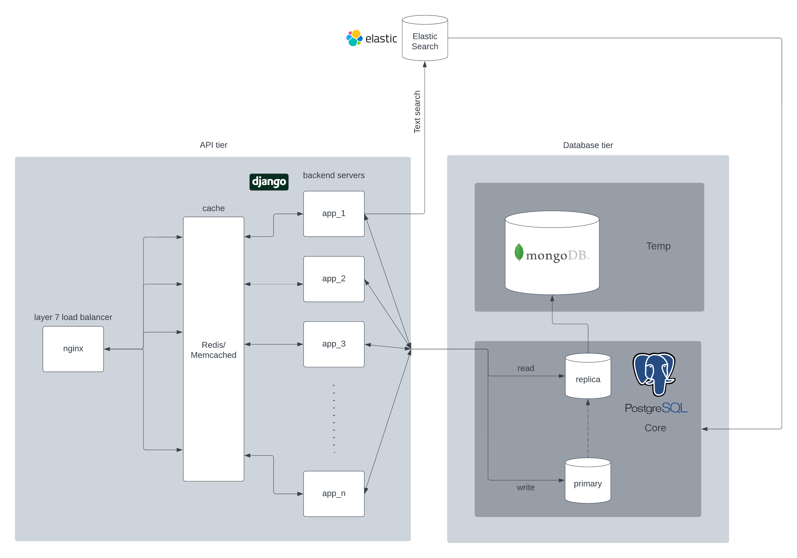

# Serve_Chat
This a distributed system based chat application made using Django Channels, Postgres and MongoDB.
## Project Architecture:

<p align="center">
    
</p>


## Run with docker compose (Recommended for testing)
In order to run the application as isolated docker container network run following command in terminal of your project directory.

<br/>


Build images and run containers
```bash
docker-compose up --scale app=3
``` 
Run migration scripts
```bash
docker-compose run app python manage.py migrate
```
The server is now up and running in http://localhost:8000/
the mapped database volume directory will be created as "data" in your project directory.

## Setup development environment

In order to setup local development environemnt you can simply create a virtual environment with -env in the end of environment name to ensure it is ignored by .dockerignore and .gitignore. `requirements.txt` for individual service is provided in it's directory.